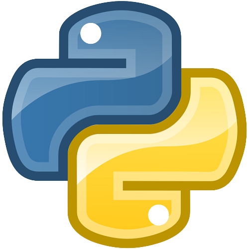
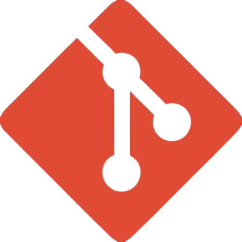
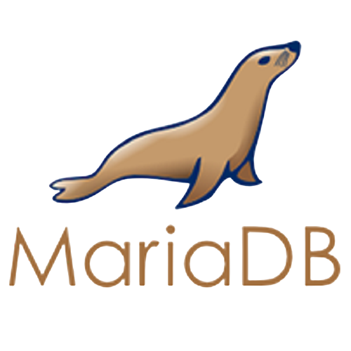
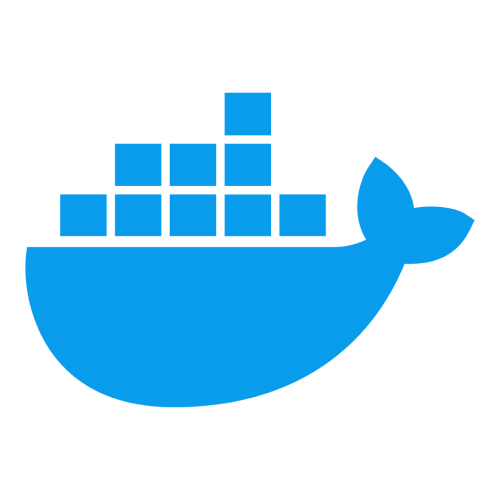
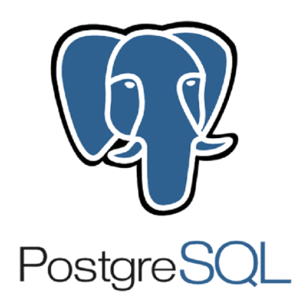

#  Ruzz

Coding Is Life

If you're interested in collaborating, feel free to reach out to me!</h5>

I'm also available for commission work.

## My Advanced Expertise:

    
    
    
    
    

## My Intermediate Expertise:

    
    
    
    

## My Basic Expertise:

    
    
    
    

