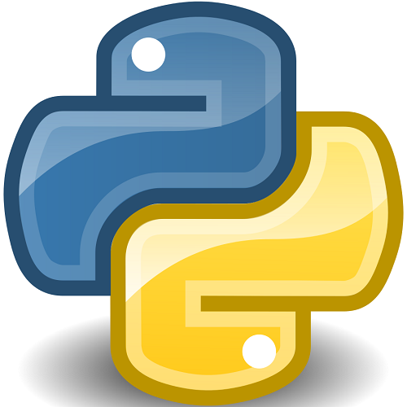
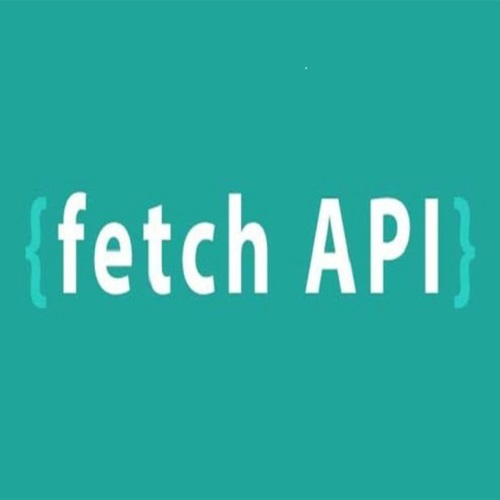

#  Ruzz

Coding Is Life

If you're interested in collaborating, feel free to reach out to me!</h5>

I'm also available for commission work.

## My Advanced Expertise:

    
    
    
    
    
    

## My Intermediate Expertise:

    
    
    
    

## My Basic Expertise:

    
    
    

# set-up repository

This project demonstrates how to set up a new Git repository with sparse checkout.

## Getting Started

### Prerequisites

- Ensure you have Git installed on your machine.
- You need access to a remote Git repository (e.g., on GitHub).

### Initial Setup For All Directory
git clone <repo-url>

### Initial Setup For Individual Directory

Follow these steps to initialize a new Git repository with sparse checkout:

### 1. Create a New Directory:
mkdir <my-new-project>
cd <my-new-project>

### 2. Initialize the Repository:
git init

### 3. Add the Remote Repository:
git remote add origin <repo-url>

### 4. Enable Sparse Checkout:
git sparse-checkout init --cone

### 5. Specify the Directory to Pull:
#### directory name in Vue-Flask repository
git sparse-checkout set <e.g config-1>

### 6. Pull the Desired Branch:
git pull origin main

